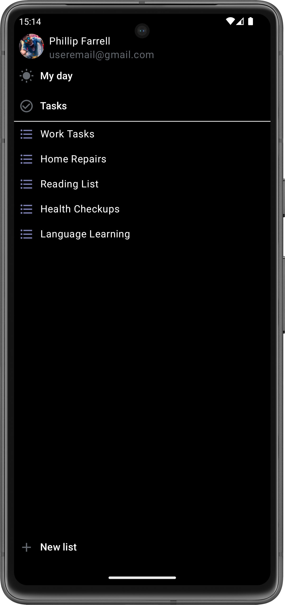
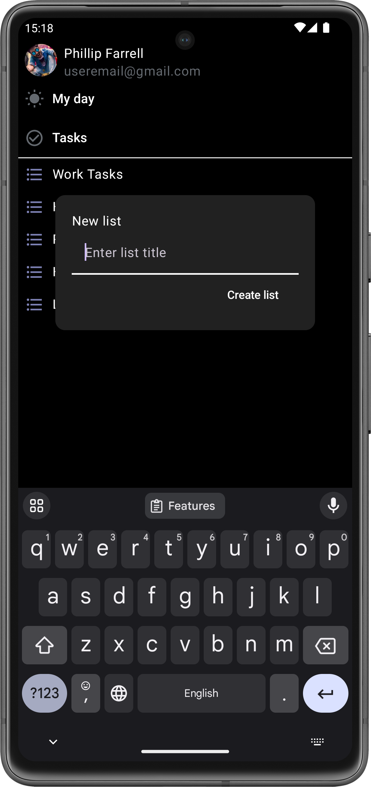
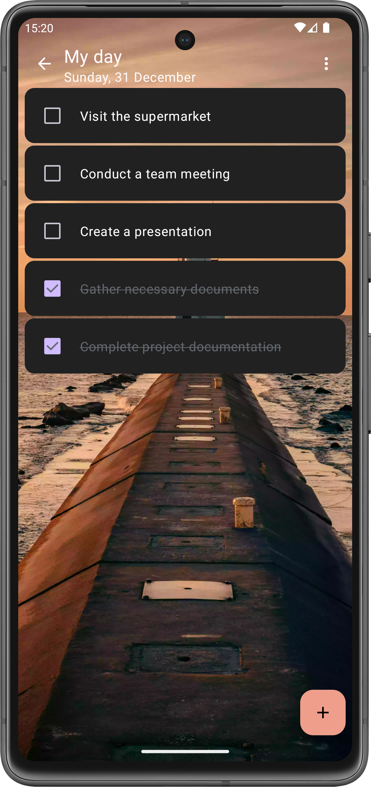
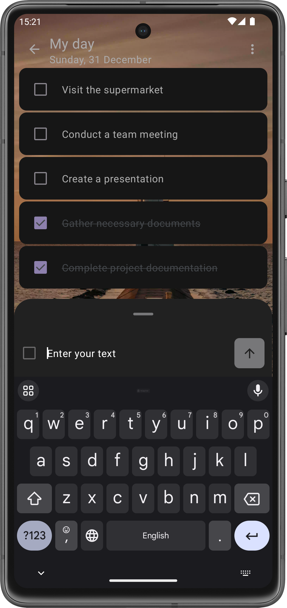
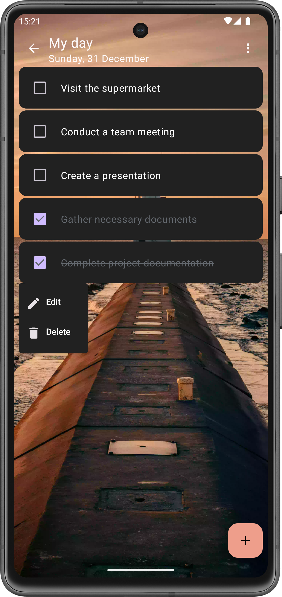
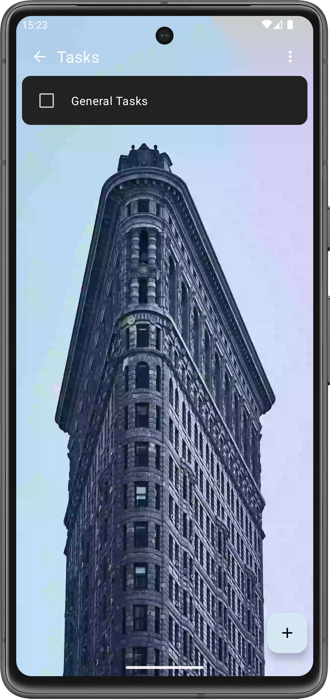
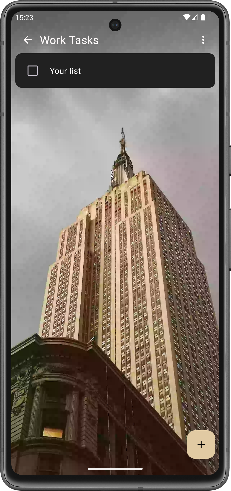

# My To Do List App with Jetpack Compose

Hey there! 👋 Welcome to my personal project – a To-Do List app designed with simplicity and productivity in mind. I built this app using Jetpack Compose for Android. Below, I've highlighted the key features and technologies that went into creating this app.

## Features:
- **User-Friendly Interface:**  Enjoy a clean and intuitive UI designed to make task management a breeze, with an edge-to-edge design for a visually immersive experience.
- **Task CRUD Operations:** Easily add, edit, and remove tasks to keep your to-do list up-to-date.
- **List Management:** Create personalized lists with tasks, and effortlessly add, edit, and remove lists for better organization.
- **Custom Backgrounds:** Personalize each list by changing its background, allowing you to create a visually appealing and organized task environment.
- **Default Lists:** Benefit from two default lists, "My Day" for tasks with a daily deadline and "Tasks" for general, timeless tasks. Uncompleted tasks from "My Day" automatically move to the "Tasks" list at the end of the day.
- **Effortless Task Completion:** Quickly mark tasks as complete with a simple tap, adding a satisfying touch to your productivity.
- **Local Storage with Room Database:** Your data is securely stored locally using Room Database, ensuring efficient and reliable task management without the need for constant internet connectivity.
- **Adaptive Dark Mode:** Seamlessly switch between light and dark modes based on your Android phone's theme, providing a comfortable and visually pleasing experience.
- **Multilingual Support:** Choose from three supported languages - English, Russian, and Ukrainian - ensuring a personalized experience for users around the world.
- **Smooth Screen Transitions:** Experience a visually pleasing journey with seamless animations when switching between screens, enhancing the overall user interface and providing an engaging and polished feel.
- **Sync with Google Drive (Planned):** Soon, enjoy the convenience of syncing your app data with Google Drive, ensuring that your tasks are seamlessly accessible across multiple devices.

## Technologies Used:
- **Kotlin:** Powering the core functionality with its concise and expressive syntax.
- **Compose:** Creating a visually appealing and dynamic user interface for a modern and seamless user experience.
- **Room Database:** Safeguarding and efficiently managing local data storage for a reliable and responsive task management system.
- **Flow:** Enabling smooth and asynchronous data flow, enhancing the app's responsiveness and performance.
- **Compose Navigation:** Facilitating intuitive and structured navigation within the application.
- **Preference DataStore:** Efficiently handling app preferences for a personalized and user-friendly experience.
- **WorkManager:** Orchestrating background tasks and ensuring optimal task scheduling for improved efficiency.
- **Splash Screen:** Enhancing user engagement with a visually appealing splash screen during app initialization.
- **Coroutines:** Implementing lightweight and efficient concurrency for seamless task execution.
- **Material Design:** Adhering to the principles of Material Design for a consistent and aesthetically pleasing user interface.
- **Glide:** Streamlining the loading and caching of images for a smoother and more responsive app experience.

## Light Theme Screenshots

  
  
  
  

  
  
  
  

## Dark Theme Screenshots

  
  
  
  

  
  
  
  

